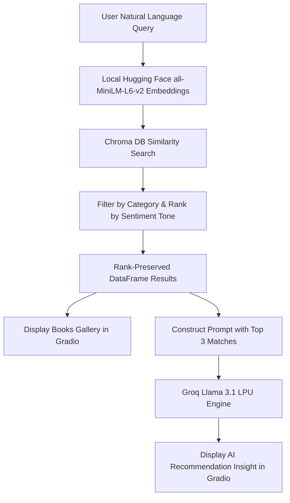

# AI Semantic Book Recommender & Recommendation Analyst

A hybrid semantic book recommendation engine designed to find books based on natural language queries, filter by genre, and sort by emotional tone. It utilizes **Chroma DB** for local vector search, a local **Hugging Face embedding model**, and leverages **Groq API** to generate real-time AI analyst reviews explaining why the recommendations fit your search query.

---

## 🚀 Key Technical Accomplishments & Optimizations

*   **Cost-Efficient Vector Search:** Implemented **Hugging Face `all-MiniLM-L6-v2`** to generate 384-dimensional dense embeddings locally. This removed dependencies on paid OpenAI API calls for vector search.
*   **AI Recommendation Analyst (Groq Llama 3.1):** Integrated the **Groq API** (`llama-3.1-8b-instant` model) to act as a real-time recommendation analyst. The LLM processes search context and generates explanations explaining why each book fits the user's prompt.
*   **Rank Preservation Sorting:** Fixed a critical bug in the retrieval logic where database filtering discarded the Chroma DB similarity ranking. Mapped vector distances back into pandas DataFrames to preserve semantic ranking.
*   **Sub-Second Startup (Chroma Persistence):** Configured local storage for **Chroma DB** (`./chroma_db`). Vector indexing of the book database is cached on the first launch, enabling immediate, zero-latency startup on subsequent runs.
*   **Interactive Web UI & Public Sharing:** Designed a responsive, split-pane dashboard using **Gradio** featuring a customized glassmorphic interface, where recommendations populate on the left and the AI analyst insights populate on the right. Enabled temporary public link sharing for easy remote testing.

---

## 🔗 Live Demos & Sharing

### 1. Temporary Public Link (Local Host)
When running the server locally, Gradio automatically generates a public, shareable link that allows anyone to access your local app instance remotely for 72 hours:
```text
* Running on local URL:  http://127.0.0.1:7860
* Running on public URL: https://xxxxxxxxxxxxxx.gradio.live
```

### 2. Permanent Deployment (Hugging Face Spaces)
For permanent hosting so recruiters and other developers can try the project anytime:
*   This project is configured to run out-of-the-box on Hugging Face Spaces.
*   **Demo URL Template:** `https://huggingface.co/spaces/3umrr/llm-semantic-book`
*   *How to deploy:* Simply create a new Gradio Space on Hugging Face, upload `gradio_dashboard.py`, `books_with_emotions.csv`, `tagged_description.txt`, `cover-not-found.jpg`, and `requirements.txt`, then add your `GROQ_API_KEY` under the Space's Settings secrets.

---

## 🛠️ Technology Stack

*   **Orchestration:** LangChain (Chroma, TextLoader, CharacterTextSplitter)
*   **Embeddings:** Hugging Face sentence-transformers (`all-MiniLM-L6-v2`)
*   **LLM Engine:** Groq API (`llama-3.1-8b-instant`)
*   **Vector Database:** Chroma DB (local persistent SQLite storage)
*   **Web Framework:** Gradio
*   **Data Processing:** Pandas, NumPy
*   **Environment:** Python 3.11/3.12 (Windows & Linux compatible)

---

## 📂 Project Structure

```text
├── chroma_db/               # Persisted local Chroma vector database files
├── books_with_emotions.csv  # Metadata database (categories, sentiment classification scores)
├── tagged_description.txt   # Normalized raw descriptions for vector indexing
├── gradio_dashboard.py      # Main application entry point (UI & search logic)
├── requirements.txt         # Minimal production dependencies
├── .env                     # Configuration keys (API Keys)
├── README.md                # System documentation
│
# Step-by-Step ML & Preprocessing Pipelines (Jupyter Notebooks):
├── data-exploration.ipynb   # Raw dataset loading, cleaning, and preparation
├── text-classification.ipynb# Zero-shot classification for category filtering
├── sentiment-analysis.ipynb # Sentiment/emotion score extraction
└── vector-search.ipynb      # Prototyping local embedding search & database creation
```

---

## ⚙️ Installation & Setup

### 1. Clone & Navigate
```bash
git clone https://github.com/3umrr/llm-semantic-book.git
cd llm-semantic-book
```

### 2. Install Dependencies
```bash
pip install -r requirements.txt
```

### 3. Configure API Credentials
Create a `.env` file in the root directory (or update the existing one) with your Groq API credentials:
```env
GROQ_API_KEY=your_groq_api_key_here
```

### 4. Run the Application
```bash
python gradio_dashboard.py
```
*Note: On the first execution, the local Hugging Face transformer will download and vector-index the book records. Subsequent runs start instantly.*

---

## 🔍 How It Works (Pipeline Architecture)



1. **User Query Input:** The user types a natural language prompt (e.g. *"a mystery set in London"*), selects a category facet, and optionally sorts results by emotional tone (joy, sadness, anger, fear, surprise).
2. **Dense Retrieval:** The prompt is converted into a vector and queried against the local Chroma database.
3. **Structured Filtering:** Results are filtered by category and re-sorted by extracting NLP sentiment metrics (e.g. sorting by highest "joy" or "surprise").
4. **Analyst Prompting:** The top recommendations are bundled into a contextual prompt and dispatched to Groq's high-speed inference queue.
5. **UI Rendering:** The Gradio frontend displays covers/descriptions in a card grid on the left and the AI explanation on the right.
